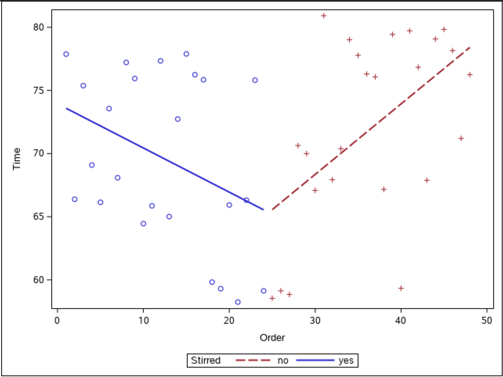

```{r setup, include = FALSE}
library(readr)
library(knitr)
library(dplyr)
library(GGally)
library(ggplot2)
knitr::opts_chunk$set(echo = FALSE, message = FALSE)
```

# Executive Summary  
*A one or two paragraph summary that includes a description of the experiment, significant results (including any interesting numerical results), and any conclusions you draw. The reader should be able to glean all the important aspects of your work from the executive summary. Effectively and succinctly convey objectives, summary of experimental design, and results and conclusions drawn from experiment.*  


# Introduction  

The purpose of this experiment is to investigate specific factors and their effect on the amount of time it takes to dissolve a cold medicine tablet in water. The data is from an “Effervescent Experiment” designed to compare dissolving times of two different brands of tablets (name brand and store brand) at three different equally spaced water temperatures (6$^\circ$C, 23$^\circ$C, and  40$^\circ$C). The run order number, as well as whether or not the sample was stirred, were also recorded and are investigated in the analysis portions of this report.  

Below, we have a brief look at the first 10 of 48 rows of data in order to begin to gain an understanding of the data set we are working with.  

```{r data}
data <- read_csv("effervescence.csv")
data$Brand <- as.factor(data$Brand)
data$Stirred <- as.factor(data$Stirred)
data$Temp <- as.factor(data$Temp)
data$Order <- as.factor(data$Order)
kable(head(data, n = 10), caption = "First 10 Rows of Effervescence Data")
```


# Experimental Design  

The experiment carried out was a complete block design where *b* = 2 blocks (by stirred status) were selected with *n* = 4 observations on each of the treatment combinations in each block. In Block I, the water was stirred using a magnetic stirring plate at 350 revolutions per minute, whereas in Block II, the water was not stirred. The time for the tablet to dissolve was measured from the moment the tablet was dropped into the water to the time the tablet was completely dissolved, and each tablet was dropped from a fixed height into 60mL of water. The observation was taken as an average of the times as measured by four experimenters and was recorded, along with the run order for each observation. The primary effects being investigated are `Brand` and `Temp`, though `Stirred` and `Order` are also considered in the analysis portion below.    


# Exploratory Analysis  

Summary statistics for each variable can be seen below. For the `Brand`, `Temp`, `Stirred`, and `Order` variables, we can see counts for each level. For the `Time` variable, we can see a five-number summary for the variable.  

```{r summary stats}
kable(summary(data), caption = "Summary Stats for Variables", digits = 2)
```

The summary statistics for the `Time by Group Table` below shows a decrease in mean dissolving time as temperature increases regardless of `Brand` or `Stirred` status. "Name Brand" generally had a higher mean dissolving time, but occasionally, "Store Brand" had a higher mean dissolve time. The same was true for when the water was not stirred, both instances at the 6 degrees Celsius. There were also some unusually high standard deviations for "Name Brand" at 23 and 40 degrees with their standard deviations at 2.64 and 1.6, respectively. In both of these instances, the water was stirred. "Store Brand" no stirred at 6 degrees also had a higher standard deviation of 1.3 whereas, overall, the standard deviations tended to range between 0.2 and 0.77.       

```{r addtl summary stats}
data_stats <- data %>%
                as_tibble() %>%
                group_by(Brand, Stirred, Temp) %>%
                summarise_at(vars(Time), list(Mean = mean, 
                                              SD = sd,
                                              Min = min, 
                                              Q1 = ~quantile(., probs = 0.25), 
                                              Median = median, 
                                              Q3 = ~quantile(., probs = 0.75), 
                                              Max = max))
kable(data_stats, caption = "Summary Stats for Time by Group", digits = 2)
```

The box plot below displays a five-number summary of dissolving time for each brand of tablet. The plot displays `Time` as a function of `Brand` and indicates that there is an effect of the brand on time.  

```{r box plot time v brand, fig.align = 'center', out.width = "270px"}
ggplot(data, aes(x = Brand, y = Time)) + 
  geom_boxplot(fill = "cornflowerblue") + 
  labs(title = "Tablet Dissolve Time for Brand", x = "Brand", y = "Time (in seconds)") +        scale_x_discrete(labels = c("Name", "Store")) +
  theme(plot.title = element_text(hjust = 0.5))
```

The box plot below displays a five-number summary of dissolving time for each stirred status. The box plot displays `Time` as a function of `Stirred` and indicates that there is an effect of the stirred status on time.  

```{r box plot time v stirred status, fig.align = 'center', out.width = "270px"}
ggplot(data, aes(x = Stirred, y = Time)) + 
  geom_boxplot(fill = "cornflowerblue") + 
  labs(title = "Tablet Dissolve Time for Stirred Status", x = "Stirred Status", y = "Time (in seconds)") + scale_x_discrete(labels = c("No", "Yes")) +
  theme(plot.title = element_text(hjust = 0.5))
```

The box plot below displays the dissolving time for different water temperatures. `Time` is displayed as a function of `Temperature`, however, we can also see how the `Brand` and `Stirred` variables affect the dissolving time by observing the color and shape of the points. It is clear that a warmer temperature reduces the dissolving time. It also appears that, as mentioned above, stirring the water reduces the dissolving time and that at the higher temperatures, the store brand dissolves more quickly than the name brand tablets.   

```{r box plot time v temp, fig.align = 'center', out.width = "320px"}
ggplot(data, aes(x = Temp, y = Time)) + 
  geom_boxplot() + 
  geom_point(aes(color = Stirred, shape = Brand)) + 
  labs(title = "Tablet Dissolve Time for Water Temperature", 
       x = "Temperature (in degrees Celcius)", 
       y = "Time (in seconds)") + 
  scale_shape_discrete(labels = c("Name", "Store")) + 
  scale_color_manual(values = c("cornflowerblue", "blue4"), labels = c("No", "Yes")) +
  theme(plot.title = element_text(hjust=0.5))
```


# Analysis and Results  

## Two Factor Crossed Mixed Effects Model  

The diagnostic plots look pretty good. The residuals plot shows residuals randomly scattered around zero, and the Q-Q plot suggests they are normally distributed (with the possible exception of one observation, which may be an outlier). The scale-location plot shows the spread is constant over the range. 

```{r model 1, fig.align = 'center', out.width = "270px"}
amod1 <- aov(Time ~ Brand + Temp + Brand:Temp, data = data)
par(mfrow = c(2,2), mar = c(2, 2, 2, 2))
plot(amod1, pch = 19)
par(mfrow = c(1,1), mar = c(5.1, 4.1, 4.1, 2.1))
summary(amod1)
```

Our model is $Y_{ijk}=\mu+\alpha_i+B_j+(\alpha B)_{ij}+\epsilon_{ijk}$  

for $i=1,2$;  $j=1,2,3$;  $k=1,...,8$  

where $B_j$*~iid* $N(0,\sigma_B^2)$;  $(\alpha B)_{ij}$*~iid* $N(0,\sigma_{\alpha B}^2)$;  $\epsilon_{ijk}$*~iid* $N(0,\sigma^2)$  
*We also require that each of the above are independent of each other.*   

$Y_{ijk}$ is the dissolving time  
$\mu$ is the overall mean  
$\alpha_i$ is the fixed effect due to the ith brand  
$B_j$ is the random effect due to the jth temperature  
$\alpha B_{ij}$ is the interaction effect between the ith brand and jth temp  
$\epsilon_{ijk}$ is the error term  

## Three Factor Analysis of Variance Model  

The diagnostic plots look pretty good. The residuals plot shows residuals randomly scattered around zero, and the Q-Q plot suggests they are normally distributed in general. However, this model is more affected by outliers compared to the previous one. The scale-location plot shows the spread is constant over the range. 

```{r model 2, fig.align = 'center', out.width = "270px"}
amod2 <- aov(Time ~ Brand + Temp + Stirred, data = data)
par(mfrow = c(2,2), mar = c(2, 2, 2, 2))
plot(amod2, pch = 19)
par(mfrow = c(1,1), mar = c(5.1, 4.1, 4.1, 2.1))
summary(amod2)
```

Our model is $Y_{ijk}=\mu+\alpha_i+B_j+\gamma_k+\epsilon_{ijkl}$  

for $i=1,2$;  $j=1,2,3$;  $k=1,2$;  $l=1,2,3,4$  

where $B_j$*~iid* $N(0,\sigma_B^2)$;  $\epsilon_{ijkl}$*~iid* $N(0,\sigma^2)$  
*We also require that each of the above are independent of each other.*  

$Y_{ijkl}$ is the dissolving time  
$\mu$ is the overall mean  
$\alpha_i$ is the fixed effect due to the ith brand  
$B_j$ is the random effect due to the jth temperature  
$\gamma_k$ is the fixed effect due to the kth stirred status  
$\epsilon_{ijkl}$ is the error term  

## Three Factor Crossed Mixed Effects Model 

The diagnostic plots look pretty good. The residuals plot shows residuals randomly scattered around zero, and the Q-Q plot suggests they are normally distributed in general. However, this model is more affected by outliers compared to the first model. The scale-location plot shows the spread is constant over the range.

```{r model 3, fig.align = 'center', out.width = "270px"}
amod3 <- aov(Time ~ Brand*Temp*Stirred, data = data)
par(mfrow = c(2,2), mar = c(2, 2, 2, 2))
plot(amod3, pch = 19)
par(mfrow = c(1,1), mar = c(5.1, 4.1, 4.1, 2.1))
summary(amod3)
```

Our model is $Y_{ijkl}=\mu+\alpha_i+B_j+\gamma_k+(\alpha B)_{ij}+(\alpha\gamma)_{ik}+(B\gamma)_{jk}+(\alpha B\gamma)_{ijk}+\epsilon_{ijkl}$  

for $i=1,2$;  $j=1,2,3$;  $k=1,2$;  $l=1,2,3,4$   

where $B_j$*~iid* $N(0,\sigma_B^2)$;  $(\alpha B)_{ij}$*~iid* $N(0,\sigma_{\alpha B}^2)$;  $B\gamma_{jk}$*~iid* $N(0,\sigma_{B\gamma}^2)$; $\alpha B\gamma_{ijk}$*~iid* $N(0,\sigma_{\alpha B\gamma}^2)$; $\epsilon_{ijk}$*~iid* $N(0,\sigma^2)$  
*We also require that each of the above are independent of each other.*  

$Y_{ijkl}$ is the dissolving time  
$\mu$ is the overall mean  
$\alpha_i$ is the fixed effect due to the ith brand  
$B_j$ is the random effect due to the jth temperature  
$\gamma_k$ is the fixed effect due to the kth stirred status  
$\alpha B_{ij}$ is the interaction effect between the ith brand and jth temp  
$\alpha\gamma_{ik}$ is the interaction effect between the ith brand and kth stirred status  
$B\gamma_{jk}$ is the interaction effect between the jth temp and kth stirred status  
$\alpha B\gamma_{ijk}$ is the interaction effect between the ith brand jth temperature and kth stirred status  
$\epsilon_{ijkl}$ is the error term  

## Using Order as a Covariate with Time  

When we graph the Order variable with respect to Time and group it by Stirred, there appears to be a linear association between the two blocks, albeit weak, but when we look at the two blocks separately, we can see the potential of using Order as a covariate to assist us in determining if there is a difference in dissolving times between the two blocks.

```{r, echo = FALSE, eval = TRUE, fig.align='center', out.width = "270px"}

```  

For Block 1, where the liquid was stirred, there appears to be a downward linear trend in the dissolving time of the cold medicine tablets. For Block 2, where the liquid was not stirred, there appears to be an upward linear trend in the dissolving time of the cold medicine tablets. Since the `Order` variable directly matches the `Stirred` variable, meaning the first 24 values of `Order` coincide with Block 1 and the second 24 values of `Order` coincide with Block 2 and the slopes for the two Blocks are not moving in the same direction as we can observe looking at our initial graph, we can write our model as follows: 
  
$$Time = Mean + Brand + Temp + Brand*Temp + Error$$
  
When we look at our model for Block 1 and Block 2, we see that our regression slopes are not all equal to 0 given the p-values (<0.001) for both models are less than our significance level of 0.05 and that there is a significant interaction effect. Since we have different slopes we can look at the differences between `Brand` and `Temp` at the different levels. For both Blocks, we can see that there was not a significant difference between the Brands at 6 degrees Celsius.


# Conclusion  

The model which describes this experiment best is the Three Factor Crossed Mixed Effects Model. When comparing MSE between the models, this model has the lowest value at 1.2. MSE is the average of the squared errors, so a lower value indicates a lower error and a better model fit. This model includes three explanatory variables, `Brand`, `Temp`, and `Stirred`. While `Brand` and `Stirred ` are fixed effects because we are only interested in comparing "Name Brand" vs "Store Brand" and "Stirred" vs "Not Stirred", `Temp` is a random effect since the three temperatures have presumably been selected as a sample from the total population of temperatures at which one might dissolve a tablet. In reviewing the analysis of variance table for this model, we can see that all model terms are significant at the 5% level aside from one, the interaction effect between `Temperature` and `Stirred`. This is confirmed in the interaction plot below, where we observe the two lines to be parallel. We can see that the temperature reduces the dissolve time and whether or not it is stirred also affects dissolve time, but that temperature of the water and stirred status do not depend on the value of one another.

```{r interaction, fig.align='center', out.width = "220px"}
interaction.plot(data$Temp, data$Stirred, data$Time,
                 type = "b", pch = 19, col = c(2,4),
                 main="Interaction Plot for Temp and Stirred Status",
                 trace.label = "Stirred?",
                 xlab = "Temperature",
                 ylab = "Mean Dissolve Time")
```

Additionally, we had to consider what to do with the blocking variable, `Stirred`. In order to investigate the effect of this on the response, we considered a two factor crossed mixed effects model without it and a three factor crossed mixed effects model with it. It is clear that the model which includes this variable is a much better model and the `Stirred` term was highly significant at the 1% level.  

Finally, we should address the limitations on our analysis...   

# Appendix  

```{r tukey}
TukeyHSD(amod3)
```
